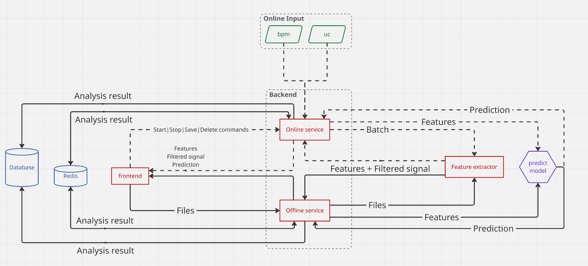

# [Архитектурная диаграмма системы](https://miro.com/welcomeonboard/V2NQWVU0NGd0YUEvakpBNlE3R3U4UnJhRDd6cEZFL1BwSkc2V3pWVUEwTUJBRnZZQ2ppNFh4OHVGS1FsaGFyRXdoUVFYZlJQaFNLdVVDaWp4amhxMEYwY3VlQUY4c2dIU283ekxzbWZjTkl0MHFyL2tvVEJyNjU3M0hMQzFXUC9yVmtkMG5hNDA3dVlncnBvRVB2ZXBnPT0hdjE=?share_link_id=460498341542)

## Общая схема
Система представляет собой модульную архитектуру, где фронтенд взаимодействует с бэкендом через REST API, а бэкенд-сервисы обмениваются данными через gRPC. Это позволяет разделить задачи обработки данных в реальном времени и оффлайн-анализа архивных записей, обеспечивая высокую производительность и масштабируемость.

## Компоненты системы

### 🖥️ Фронтенд
- **Технологии**: Vanilla JS + Vite (с tree-shaking для оптимизации сборки), Chart.js для визуализации данных.
- **Роль**: 
  - Отображение интерактивных графиков КТГ и результатов анализа
  - Загрузка файлов для оффлайн-анализа
  - Отображение потоковых данных в режиме реального времени
- **Особенности**:
 - Низкая нагрузка на устройство
 - Наглядность важных метрик
 - Цветовая индикация

### ⚙️ Бэкенд-сервисы

#### 🚦 Онлайн-сервис (Go)
- **Роль**: Прием и обработка потоковых данных в реальном времени (например, от фетальных мониторов).
- **Особенности**:
  - Поддержка стриминга данных через gRPC
  - Низкая задержка обработки (<250 мс)
  - Интеграция с Redis для временного хранения сессий

#### 📁 Оффлайн-сервис (Go)
- **Роль**: Обработка архивных файлов КТГ (например, из медицинских систем).
- **Особенности**:
  - Интеграция с Redis для временного хранения сессий
  - Интеграция с PostgreSQL для сохранения результатов

#### 🧮 Feature-extractor (Python)
- **Роль**: Фильтрация шумов и расчет медицинских метрик (частота сердцебиения, вариабельность, акцелерации и т.д.).
- **Особенности**:
  - Алгоритмы фильтрации на основе медианного окна и частотного анализа
  - Автоматическое выделение ключевых событий на КТГ
  - Расчет ключевых метрик для работы ML-модели

#### 🤖 Model-service (Python)
- **Роль**: Прогнозирование рисков осложнений беременности с использованием CatBoost.
- **Особенности**:
  - Модель, обученная на клинических данных
  - Интерпретируемость результатов (пояснения к прогнозам)
  - Поддержка batch-обработки для архивных данных

### 🗃️ Базы данных

#### 📊 PostgreSQL
- **Роль**: Хранение сохраненных результатов анализа.

#### 🌪️ Redis
- **Роль**: Кеширование несохраненных сессий и промежуточных результатов.

## Ключевые преимущества архитектуры
- **Гибкость**: Независимое масштабирование сервисов (например, увеличение числа экземпляров Model-service при высокой нагрузке)
- **Надежность**: Разделение ответственности между сервисами минимизирует риски сбоев
- **Производительность**: gRPC обеспечивает быструю передачу данных между сервисами, а Redis ускоряет доступ к временным данным
- **Масштабируемость**: Возможность добавлять новые сервисы (например, для анализа других типов данных) без изменения основной архитектуры